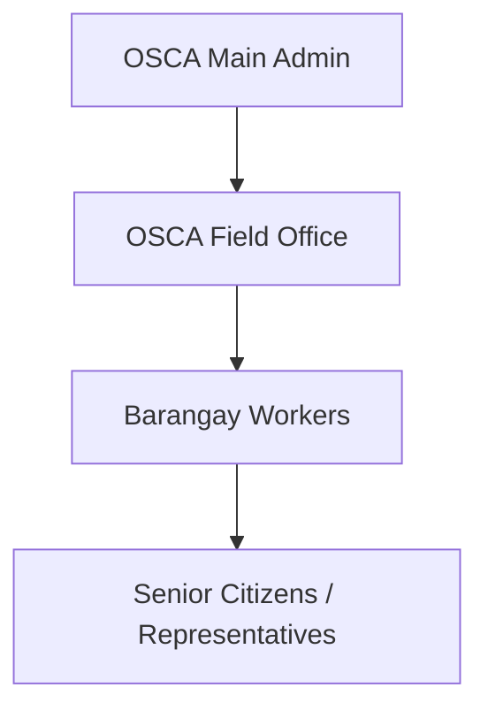
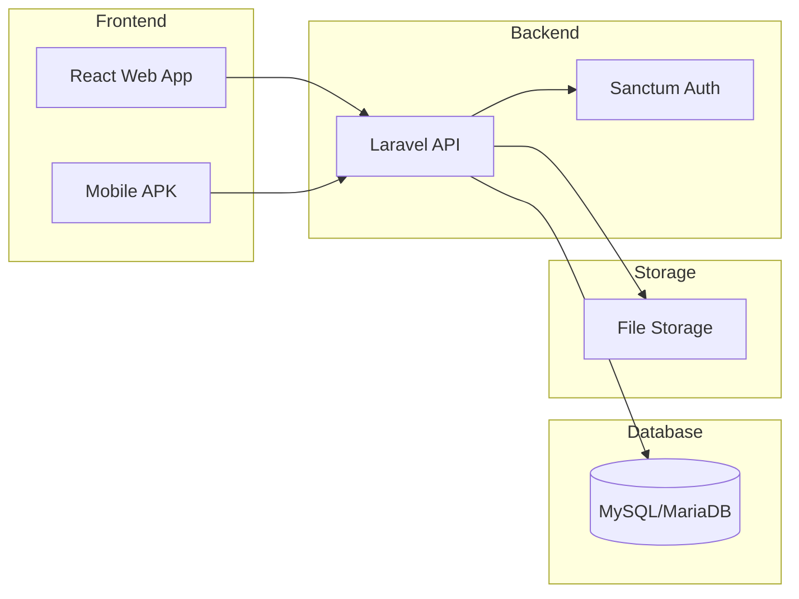
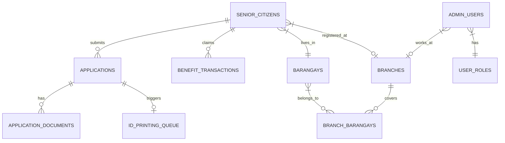

# Product Requirements Document (PRD)
# Senior Citizens Information System (SCIS)
## Zamboanga City OSCA

**Version:** 1.0  
**Date:** January 29, 2026  
**Project Type:** Web Application + Mobile APK  
**Course:** Software Engineering  

---

## 1. Executive Summary

### 1.1 Project Overview
The Senior Citizens Information System (SCIS) is a comprehensive digital platform designed to modernize the operations of the Office of Senior Citizens Affairs (OSCA) in Zamboanga City. The system replaces the current paper-based registration and benefits management process with an integrated web and mobile solution.

### 1.2 Problem Statement
Currently, OSCA operates on a paper-based system which leads to:
- **Duplicate registrations** across different barangays
- **Inefficient document processing** between field offices and main OSCA
- **Poor tracking** of benefits eligibility and claims
- **No centralized database** for senior citizen records
- **Manual ID printing** without proper queue management

### 1.3 Solution
SCIS provides:
- Centralized digital registration with **duplicate detection**
- Role-based access for OSCA Main, Field Offices, and Barangay workers
- Automated **benefits tracking** (Octogenarian, Nonagenarian, Centenarian)
- Digital **ID printing queue** management
- Public portal for online registration applications
- Mobile APK for field access

---

## 2. Stakeholders & User Roles

### 2.1 User Role Hierarchy



### 2.2 Role Definitions

| Role ID | Role Name | Access Level | Key Responsibilities |
|---------|-----------|--------------|---------------------|
| 1 | OSCA Main (Central) | Full System Access | Final registration approval, ID printing, benefits management, user accounts, all data access |
| 2 | OSCA Field Office | Branch-level Access | Document verification, application forwarding, barangay oversight within assigned branch |
| 3 | Barangay Workers | Barangay-level Access | Local event creation, initial application collection (if applicable) |
| 4 | Senior/Representative | Portal Access | Online application submission, view announcements, check status |

### 2.3 Access Matrix

| Feature | OSCA Main | OSCA FO | Barangay | Senior |
|---------|:---------:|:-------:|:--------:|:------:|
| Dashboard | ✅ Full | ✅ Branch | ✅ Barangay | ❌ |
| Registration (Approve) | ✅ | ❌ | ❌ | ❌ |
| Registration (Verify) | ✅ | ✅ | ❌ | ❌ |
| Registration (Apply) | ✅ | ✅ | ✅ | ✅ |
| ID Printing | ✅ | ❌ | ❌ | ❌ |
| Complaints | ✅ | ✅ | ✅ | ✅ |
| Announcements (Create) | ✅ | ✅ | ✅ | ❌ |
| Benefits Tracking | ✅ | 👁 View | 👁 View | 👁 Own |
| Archives | ✅ | 👁 Branch | ❌ | ❌ |
| Heat Map | ✅ | 👁 Branch | ❌ | ❌ |
| Accounts Management | ✅ | ❌ | ❌ | ❌ |
| Audit Logs | ✅ | ❌ | ❌ | ❌ |

---

## 3. System Architecture

### 3.1 Technology Stack

| Layer | Technology | Version |
|-------|------------|---------|
| **Frontend (Web)** | React + Vite | React 19, Vite 7 |
| **UI Framework** | Ant Design | 6.x |
| **State Management** | TanStack Query | 5.x |
| **Routing** | React Router | 7.x |
| **Charts** | Recharts | 3.x |
| **Maps** | Leaflet + React-Leaflet | 1.9 / 5.0 |
| **Backend** | Laravel | 12.x |
| **Authentication** | Laravel Sanctum | 4.x |
| **Database** | MySQL (MariaDB) | 11.4+ |
| **Audit Logging** | Spatie Activity Log | 4.x |
| **Mobile** | React Native | TBD |

### 3.2 System Diagram



### 3.3 API Base URL
- **Development:** `http://localhost:8000/api`
- **Production:** `https://api.scis.zamboanga.gov.ph/api` (example)

---

## 4. Functional Requirements

### 4.1 Registration Module

#### FR-REG-001: New ID Application
- **Description:** Allow creation of new senior citizen registration applications
- **Actor:** All user roles
- **Priority:** HIGH
- **Acceptance Criteria:**
  1. Form captures all required senior citizen data (name, birthdate, address, contact, etc.)
  2. System validates age ≥ 60 years
  3. System checks for **duplicate registration** using name + birthdate + barangay combinations
  4. Required documents can be uploaded (Birth Certificate, ID, Photo)
  5. Application is saved with status "Draft" or "Submitted"

#### FR-REG-002: Duplicate Detection
- **Description:** Prevent same person from registering in multiple barangays
- **Priority:** CRITICAL
- **Logic:**
  ```
  IF EXISTS (senior WHERE 
      first_name = input.first_name AND
      last_name = input.last_name AND
      birthdate = input.birthdate
  ) THEN
      REJECT with message "Senior already registered in [barangay_name]"
  ```

#### FR-REG-003: Application Workflow
- **Status Flow:**
  ```
  Draft → Submitted → Verified (by FO) → Approved (by Main) → ID Printed → ID Claimed
  ```
- Each status change is logged with timestamp and user

#### FR-REG-004: Revalidation/Update
- **Description:** Allow updating of existing senior records
- **Triggers:** Address change, contact update, photo update

#### FR-REG-005: Lost/Damaged ID Replacement
- **Description:** Process for issuing replacement IDs
- **Requirements:** Affidavit of Loss, Payment receipt

---

### 4.2 ID Printing Module

#### FR-ID-001: Print Queue Management
- **Description:** Queue system for ID printing at OSCA Main
- **Priority Level:** Normal, Urgent, Express
- **Queue Fields:** Queue Number, Senior Name, Application Type, Status, Requested Date

#### FR-ID-002: Batch Printing
- **Description:** Select multiple approved applications for batch printing
- **Output:** Printable ID card format (with QR code)

#### FR-ID-003: ID Card Template
- **Fields on ID:**
  - OSCA ID Number
  - Full Name
  - Photo
  - Birthdate
  - Address
  - QR Code (links to digital profile)
  - Issue Date
  - Expiry Date

---

### 4.3 Benefits Tracking Module

#### FR-BEN-001: Age-Based Eligibility
| Benefit Category | Age Range | Cash Benefit |
|-----------------|-----------|--------------|
| Sexagenarian | 60-69 | — |
| Septuagenarian | 70-79 | — |
| Octogenarian | 80-89 | ₱10,000 |
| Nonagenarian | 90-99 | ₱10,000 |
| Centenarian | 100+ | ₱100,000 |

#### FR-BEN-002: Claim Tracking
- Track if benefit has been availed
- Show unclaimed benefits (e.g., "92 yrs old, hasn't claimed Octogenarian")
- Record claim date, amount, processed by

---

### 4.4 Complaints Module

#### FR-COM-001: File Complaint
- **Complainant:** Senior citizen (by OSCA ID)
- **Violator:** Individual/Establishment name
- **Categories:** Denial of Discount, Poor Treatment, etc.
- **Attachments:** Supporting documents

#### FR-COM-002: Complaint Workflow
```
Filed → Under Review → Assigned → Resolved/Closed
```

---

### 4.5 Announcements Module

#### FR-ANN-001: CRUD Operations
- Create announcements with title, description, event date, location
- Types: Event, News, Advisory, Notice
- Target audience filtering

#### FR-ANN-002: Publishing
- Draft → Published workflow
- Published announcements appear on public website

---

### 4.6 Archives Module

#### FR-ARC-001: Senior Archive Records
- View complete history of a senior citizen
- Track barangay transfers
- Deceased records with date

#### FR-ARC-002: Activity Timeline
- All changes to a senior's record (audit trail)

---

### 4.7 Heat Map Visualization

#### FR-MAP-001: Geographic Distribution
- Leaflet map of Zamboanga City
- Color-coded by senior population density per barangay

#### FR-MAP-002: Demographic Overlays
- Filter by gender, age group
- Statistics popup per barangay

---

### 4.8 Public Website

#### FR-WEB-001: Public Pages
| Page | Content |
|------|---------|
| Home | Hero, Latest Announcements, Quick Links |
| About | OSCA mission, vision, history |
| Services | List of services with descriptions |
| News | Published announcements feed |
| Contact | Address, phone, email, map |

#### FR-WEB-002: Online Application
- Public form for seniors/representatives to pre-apply
- Form validation but no account required
- Application tracked via reference number

---

### 4.9 Mobile Application

#### FR-MOB-001: APK Requirements
- React Native or equivalent
- QR code scanner for ID verification
- View senior profile
- Push notifications for events

---

## 5. Non-Functional Requirements

### 5.1 Security

| ID | Requirement |
|----|-------------|
| NFR-SEC-001 | JWT/Sanctum token-based authentication |
| NFR-SEC-002 | Role-based access control (RBAC) |
| NFR-SEC-003 | File upload validation (type: jpg/png/pdf, max: 5MB) |
| NFR-SEC-004 | Audit logging for all CRUD operations |
| NFR-SEC-005 | Password hashing with bcrypt (12 rounds) |
| NFR-SEC-006 | HTTPS enforcement in production |

### 5.2 Performance

| ID | Requirement |
|----|-------------|
| NFR-PER-001 | Page load time < 3 seconds |
| NFR-PER-002 | API response time < 500ms |
| NFR-PER-003 | Support 100+ concurrent users |

### 5.3 Scalability

| ID | Requirement |
|----|-------------|
| NFR-SCA-001 | Database designed for 100,000+ senior records |
| NFR-SCA-002 | File storage on cloud (S3-compatible) |

---

## 6. Database Schema Overview

### 6.1 Core Tables

| Table | Description |
|-------|-------------|
| `senior_citizens` | Main senior citizen records |
| `admin_users` | System users (OSCA, FO, Barangay) |
| [applications](file:///c:/xampp/htdocs/scis-v2/backend/app/Models/SeniorCitizen.php#129-133) | Registration applications |
| `barangays` | 98 barangays of Zamboanga City |
| `branches` | OSCA field offices |
| `branch_barangays` | Many-to-many: branches ↔ barangays |
| `benefits` | Benefit types and amounts |
| `benefit_transactions` | Benefit claims |
| [complaints](file:///c:/xampp/htdocs/scis-v2/backend/app/Models/SeniorCitizen.php#150-154) | Complaint records |
| `announcements` | Events and news |
| `id_printing_queue` | ID print jobs |
| `activity_logs` | Audit trail |

### 6.2 Entity Relationship (Key Relationships)



---

## 7. API Endpoints

### 7.1 Authentication
| Method | Endpoint | Description |
|--------|----------|-------------|
| POST | `/api/login` | User login |
| POST | `/api/logout` | User logout |
| GET | `/api/me` | Get current user |

### 7.2 Dashboard
| Method | Endpoint | Description |
|--------|----------|-------------|
| GET | `/api/dashboard/stats` | Statistics cards |
| GET | `/api/dashboard/upcoming-events` | Events table |
| GET | `/api/dashboard/age-distribution` | Age chart data |
| GET | `/api/dashboard/gender-distribution` | Gender chart data |

### 7.3 Seniors
| Method | Endpoint | Description |
|--------|----------|-------------|
| GET | `/api/seniors` | List with pagination |
| GET | `/api/seniors/{id}` | Single senior |
| GET | `/api/seniors/statistics` | Stats |
| GET | `/api/seniors/export` | CSV export |

### 7.4 Applications
| Method | Endpoint | Description |
|--------|----------|-------------|
| GET | `/api/applications` | List applications |
| GET | `/api/applications/{id}` | Single application |
| PATCH | `/api/applications/{id}/status` | Update status |
| POST | `/api/applications` | Create (TODO) |

### 7.5 ID Printing
| Method | Endpoint | Description |
|--------|----------|-------------|
| GET | `/api/id-printing` | Print queue list |
| PATCH | `/api/id-printing/{id}/status` | Update status |
| POST | `/api/id-printing/bulk-print` | Batch print |

### 7.6 Announcements
| Method | Endpoint | Description |
|--------|----------|-------------|
| GET | `/api/announcements` | List |
| POST | `/api/announcements` | Create |
| PUT | `/api/announcements/{id}` | Update |
| DELETE | `/api/announcements/{id}` | Delete |

---

## 8. UI/UX Requirements

### 8.1 Design System
- **Primary Color:** `#1890ff` (Ant Design Blue)
- **Font:** Inter, system fonts fallback
- **Border Radius:** 8px (cards), 12px (buttons)
- **Shadows:** Subtle, elevation-based

### 8.2 Key Screens

| Screen | Components |
|--------|------------|
| Login | Centered card, gradient background |
| Dashboard | Stat cards (gradient), charts, events table |
| Seniors List | Table with search, filters, pagination |
| Registration Form | Multi-step wizard, document upload |
| ID Printing Queue | Table with status badges, bulk actions |
| Heat Map | Full-screen Leaflet map with controls |

---

## 9. Deployment Strategy

### 9.1 Recommended Stack

| Component | Platform | Notes |
|-----------|----------|-------|
| Frontend | Vercel / Netlify | Auto-deploy from GitHub |
| Backend | Railway / DigitalOcean | Laravel optimized |
| Database | PlanetScale / Aiven | Managed MySQL |
| Storage | Cloudflare R2 / AWS S3 | File uploads |
| Domain | Custom `.gov.ph` | Government domain |

### 9.2 Environment Variables

```env
# Backend (.env)
APP_ENV=production
APP_URL=https://api.scis.example.com
FRONTEND_URL=https://scis.example.com
DB_CONNECTION=mysql
DB_HOST=your-db-host
DB_DATABASE=scis
DB_USERNAME=your-username
DB_PASSWORD=your-password
```

---

## 10. Project Timeline (Suggested)

| Phase | Duration | Deliverables |
|-------|----------|--------------|
| Phase 1 | Week 1-2 | Complete Registration module, Application workflow |
| Phase 2 | Week 3-4 | ID Printing, Benefits tracking |
| Phase 3 | Week 5-6 | Complaints, Announcements, Archives |
| Phase 4 | Week 7-8 | Heat Map, Public Website |
| Phase 5 | Week 9-10 | Mobile APK development |
| Phase 6 | Week 11-12 | Testing, Deployment, Documentation |

---

## 11. Appendix

### 11.1 Zamboanga City Barangays (98 total)
The system includes all 98 barangays of Zamboanga City, grouped into field office branches.

### 11.2 Document Types for Registration
1. Birth Certificate (NSO/PSA)
2. Valid Government ID
3. 1x1 or 2x2 Photo
4. Proof of Residency (Barangay Certificate)

### 11.3 Glossary
| Term | Definition |
|------|------------|
| OSCA | Office of Senior Citizens Affairs |
| FO | Field Office |
| SCIS | Senior Citizens Information System |
| Centenarian | Person aged 100 years or older |

---

**Document Prepared By:** AI Assistant  
**For:** Software Engineering Course Project  
**Client:** OSCA Zamboanga City
